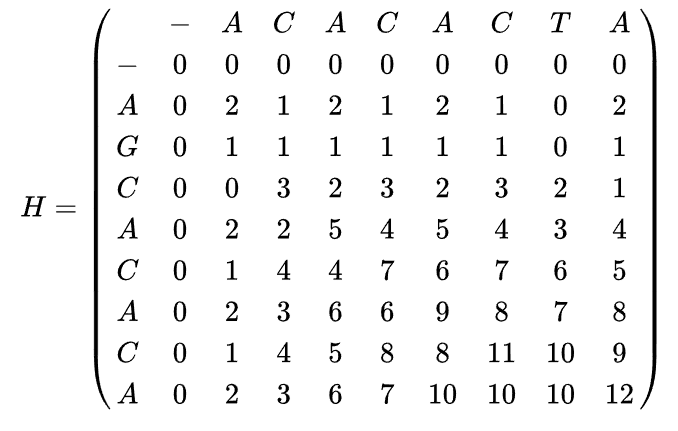

# Heurística de Alinhamento Local de Smith-Waterman

Um algoritmo ingênuo para fazer o alinhamento local de duas sequencias de DNA poderia ser:

1. Gere todas as subsequências, de tamanho 1 até o tamanho total de cada sequência
2. Compare todos os pares de subsequencias, sempre escolhendo uma subsequencia de um DNA e do outro DNA, calculado seus scores
3. Escolha uma que produza o score máximo

Nao é difícil ver que este algoritmo ingênuo pode demorar muito tempo para executar quando aumentamos o tamanho das sequencias de DNA.

Uma heurística sequencial bastante interessante para reduzir o tempo de obtenção dos alinhamentos foi proposta por Smith e Waterman (1981), utilizando programação dinâmica.
Abaixo, temos a descrição do algoritmo desta estratégia:
<pre>
ALGORITMO SMITH-WATERMAN
Entrada: Duas sequencias de DNA a[i] e b[j], de tamanhos n e m respectivamente
Saída: score máximo de alinhamento 

1. Inicializar H[i,0]=0, 0≤i≤n
2. Inicializar H[0,j]=0, 0≤j≤m
3. Para cada 1≤i≤n e 1≤j≤m:
4.     Calcular diagonal = H[i-1,j-1] + w(a[i],b[j]), onde w(a[i],b[j])=2 se houve match, 
                           w(a[i],b[j])=-1 se houve mismatch e  
                           w(a[i],b[j])=0 se houve gap
5.     Calcular deleção  = H[i-1,j] - 1
6.     Calcular inserção = H[i,j-1] - 1
7.     Calcular H[i,j]=máximo (0, diagonal, deleção, inserção)
9. Retornar o máximo de H[_,_]
</pre>

Abaixo temos um exemplo da matriz H calculada para as sequências AGCACACA e ACACACTA:

Para obter o alinhamento local ótimo, começamos com o maior valor na matriz (i,j). Então, nós vamos para trás para uma das posições (i-1,j), (i,j-1) ou (i-1,j-1), dependendo da direção de movimento usado para construir a matriz. Mantemos o processo até chegar a um célula da matriz com valor zero, ou o valor na posição (0,0).

No exemplo, o valor mais alto corresponde à célula na posição (8,8). A caminhada de volta corresponde a (8,8), (7,7), (7,6), (6,5), (5,4), (4,3), (3,2), (2,1), (1,1), e (0,0),

Uma vez que tenhamos terminado, reconstruimos o alinhamento da seguinte forma: Começando com o último valor, chegamos a (i,j) usando o caminho previamente calculado. Um salto na diagonal implica que há um alinhamento (ou uma correspondência ou uma não correspondência). Um salto de cima para baixo implica que há uma deleção. Um salto da esquerda para a direita implica que há uma inserção.

Para o exemplo das sequencias acima, obtemos o seguinte alinhamento local ótimo (em relação aos pesos dados para match, mismatch e gap):

<pre>
Sequência 1 = A-CACACTA
Sequência 2 = AGCACAC-A
</pre>

