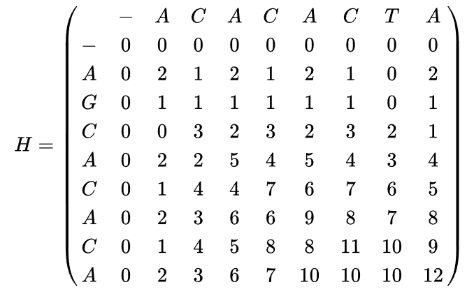

# Um algoritmo Local para Alinhamento

Como vimos em aula, aleatoriedade é uma estratégia bastante comum para construção de algoritmos de busca local, podendo ser usada
de forma isolada ou de forma complementar a outra estratégia de varredura de um espaço de soluções. Em problemas de alinhamento,
varreduras suportadas por aleatoriedade tem produzido algoritmos bastante efetivos.

Dentro deste contexto, vamos considerar o algoritmo proposto abaixo:

<pre>
ALGORITMO BUSCA LOCAL COM ALEATORIEDADE
Entrada: Duas sequencias de DNA a[i] e b[j], de tamanhos n e m respectivamente
         Um inteiro positivo p
         Pesos wmat, wmis e wgap para match, mismatch e gap respectivamente
Saída: Score de um alinhamento das sequencias
       Subsequencias alinhadas

1. Gerar uma subsequencia sb=b[j,j+1,...,j+k] de b, de tamanho aleatório k, 1<=k<=m
2. Gerar p subsequencias aleatórias sa=a[i,i+1,...,i+k], com tamanho k calculado no passo (1)
3. Calcular o score máximo m entre cada par (sa,sb)
4. Devolver o score m e as subsequencias associadas a este score
</pre>

Os passos diagonal, deleção e inserção são chamados, respectivamente, de salto em diagonal, salto de cima para baixo e salto da esquerda para a direita, e representam movimentações para obtenção do alinhamento local ótimo. 

No link abaixo, é possível simular este algoritmo para diversos valores de pesos:

http://rna.informatik.uni-freiburg.de/Teaching/index.jsp?toolName=Smith-Waterman

Abaixo temos um exemplo da matriz H calculada para as sequências AGCACACA e ACACACTA:

Para obter o alinhamento local ótimo, começamos com o maior valor na matriz (i,j). Então, nós vamos para trás para uma das posições (i-1,j), (i,j-1) ou (i-1,j-1), dependendo da direção de movimento usado para construir a matriz. Mantemos o processo até chegar a um célula da matriz com valor zero, ou o valor na posição (0,0).

No exemplo, o valor mais alto corresponde à célula na posição (8,8). A caminhada de volta corresponde a (8,8), (7,7), (7,6), (6,5), (5,4), (4,3), (3,2), (2,1), (1,1), e (0,0),

Uma vez que tenhamos terminado, reconstruimos o alinhamento da seguinte forma: Começando com o último valor, chegamos a (i,j) usando o caminho previamente calculado. Um salto na diagonal implica que há um alinhamento (ou uma correspondência ou uma não correspondência). Um salto de cima para baixo implica que há uma deleção. Um salto da esquerda para a direita implica que há uma inserção. *Assim, para a reconstrução, é importante guardar durante a montagem da tabela H qual o tipo de salto foi utilizado.*

Para o exemplo das sequencias acima, obtemos o seguinte alinhamento local ótimo (em relação aos pesos dados para match, mismatch e gap):

<pre>
Sequência 1 = A-CACACTA
Sequência 2 = AGCACAC-A
</pre>

A partir desta descrição, nosso primeiro projeto terá duas tarefas:

<ul>
  <li> Implementar um programa C++ para ler um arquivo contendo os tamanhos de duas sequencias de DNA, seguidos das duas sequencias, uma por linha. Calcular o score máximo de alinhamento local usando a heurística de Smith-Waterman. As informações para reconstrução deverão ser armazenadas no formato de struct.
  <li> a partir do score máximo, reconstruir e exibir o alinhamento local ótimo das duas sequencias.
</ul>

No diretório do projeto, há um gerador de entradas disponibilizado como um notebook Python.

Para quem estiver interessado no artigo original da heurística de Smith-Waterman, basta consultar o link http://arep.med.harvard.edu/pdf/Smith81.pdf.
